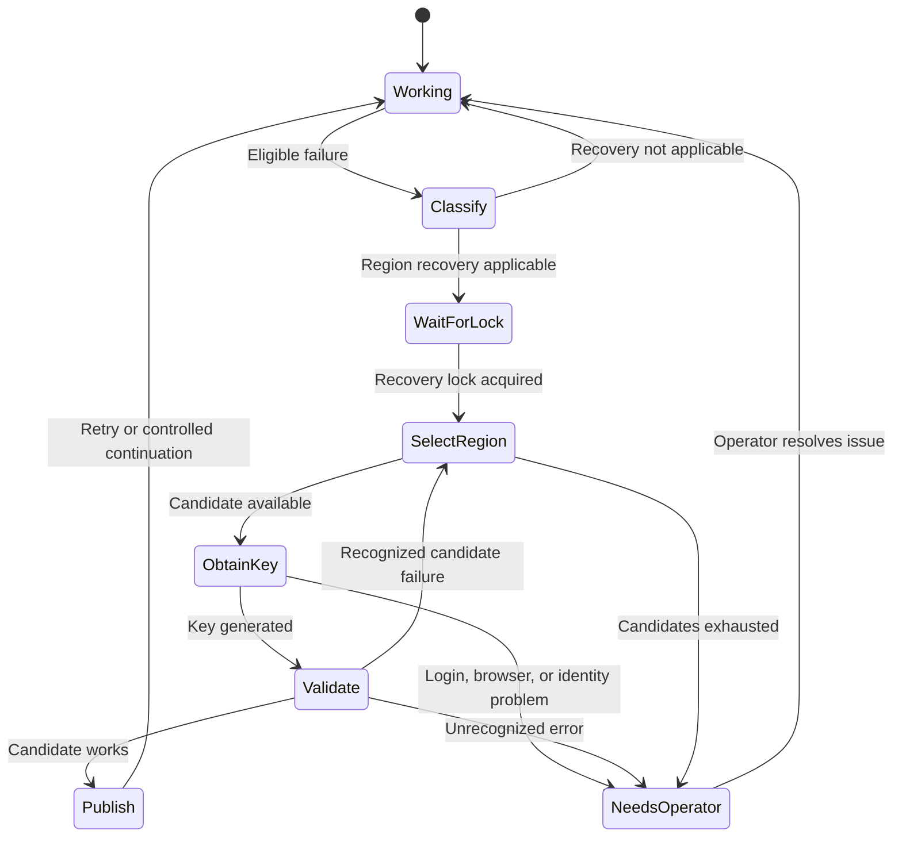

# Architecture and recovery rules

Status: proposed implementation. No live behavior is claimed by this document.

## Components

| Component | Responsibility |
| --- | --- |
| Configuration | Ordered eligible regions, exact model pins, browser profile, identity, and recovery limits |
| Hook adapter | Read `StopFailure` JSON from stdin and enqueue eligible failures |
| Recovery coordinator | Serialize operations, track attempts, classify errors, and publish one validated settings revision |
| Browser adapter | Connect to the authenticated browser, verify account/role and region, and generate the candidate key |
| Setup adapter | Drive the Claude `/setup-bedrock` wizard through a pseudoterminal |
| Optional `claude-auto` launcher | Forward terminal input/output, track a session, detect retry messages, and submit controlled continuation |

These are modules in a small utility, not separate services. Recovery uses deterministic code and does not require a working model to decide its next steps. The Playwright connection runs outside the failed Claude session.

## Recovery state machine

Each failure incident tries a candidate region/model combination at most once. Concurrent failures join the existing operation. The coordinator rechecks the settings revision after acquiring the lock; if another operation already resolved the incident, it does not generate another key.

The lock is scoped to the actual Claude configuration directory and expected AWS identity. Separate Claude configurations must not overwrite each other's settings. A stale lock is reclaimed only after its owner is confirmed dead; wall-clock age alone does not permit concurrent writers.

## Error policy

| Failure | Proposed action |
| --- | --- |
| Sustained 429 attributable to a Bedrock quota | Use existing backoff, then try the next eligible region |
| Brief 429 | Allow existing retries to succeed before rotating |
| Region/model unavailable, invalid regional model ID, or unsupported regional capability | Reject this candidate and try the next configured combination |
| Inference profile required | Use the operator's configured profile; do not invent a model mapping |
| Expired short term key | Obtain a fresh key in the current region first |
| Request validation failure unrelated to region | Report the actual error and stop recovery |
| Billing/spend limit, denied permission, or wrong identity | Stop for operator action |
| Repeated 503/529 capacity failure | Optional region recovery, subject to configured policy |
| Browser disconnected or AWS session expired | Wait for the user to reconnect or sign in |

HTTP 400 alone is insufficient for candidate rejection. Classification combines the hook error type with available error details. Unknown failures remain visible. AWS documents several distinct causes of 400. [AWS error guidance](https://docs.aws.amazon.com/bedrock/latest/userguide/troubleshooting-api-error-codes.html)

Transient candidate failures use a cooldown. A confirmed unavailable model/profile remains excluded until configuration changes or an explicit recheck. Exclusion is per identity/region/model combination, not a claim that an entire AWS region is unusable.

## Browser and wizard

The default connection is the official Playwright extension installed in the user's Chrome or Edge profile. It reuses existing authentication. The adapter controls a dedicated AWS tab, verifies the expected identity, navigates to the selected region, and extracts the newly generated key. It never closes the user's browser. [Playwright browser connection](https://playwright.dev/mcp/configuration/browser-extension)

The wizard adapter will recognize prompts, select API-key authentication, enter the key and matching region, set configured model pins, and read validation results. Blind Enter sequences are not accepted. Unexpected prompts stop the attempt with a redacted diagnostic.

The setup wizard saves its output in the Claude user settings `env` block. To prevent unsuccessful attempts changing all working sessions, prototype a helper using an isolated `CLAUDE_CONFIG_DIR`; only approved provider/model fields will be merged into the real settings after validation. Verify this isolation before enabling unattended recovery. [Claude Bedrock setup](https://code.claude.com/docs/en/amazon-bedrock)

The helper must not install the recovery hook or inherit a recovery loop. Any trust prompt for the helper's known directory is handled during initial setup; unexpected trust or permission prompts are not automatically accepted. An initial startup using stale credentials must also be tested.

## Settings publication

Preserve unrelated settings and merge the key, `AWS_REGION`, and configured model pins together. Respect `CLAUDE_CONFIG_DIR` and settings precedence. Detect conflicting project/managed settings, custom Bedrock endpoints, and small-model region overrides before claiming a successful switch. Different models may require different regional profile IDs.

Write through a temporary file, validate JSON, and use a platform-tested replacement operation. Compare with the originally read settings before publication. If the user edited the file during recovery, reread and merge or stop; never overwrite the user's changes.

Candidate keys exist in memory and, if required by the wizard, a protected temporary helper configuration. Redact key entry and echoed terminal output before display or logging. Delete temporary credentials after the attempt. Persist only required secrets in Claude's actual user settings; the utility's configuration, event log, and session registry contain no API keys.

## Retries and continuation

Claude documents a default of 10 retries, configurable through `CLAUDE_CODE_MAX_RETRIES`. A terminal launcher can observe eligible failure output before that budget is exhausted; a `StopFailure` hook receives a terminal failure. [Claude environment variables](https://code.claude.com/docs/en/env-vars)

Claude reapplies changed settings `env` values to running processes. This does not prove that an in-flight Bedrock client/request rebuilds its endpoint or authentication for a retry. Verify separately: changed key, changed region, next request, and retry already in progress. [Settings environment updates](https://code.claude.com/docs/en/env-vars#in-settings-files)

The hook-only version updates validated settings and notifies the operator. It does not claim automatic continuation. Already retrying sessions may recover naturally if the prototype demonstrates that behavior.

The optional launcher records the exact session ID and working directory, forwards all ordinary user input, and observes terminal state. It submits one continuation only after recovery succeeds and the session is at an idle prompt following the eligible failure. It never injects input into a busy session, permission dialog, slash-command menu, or terminal with unsubmitted user text.

If live switching fails, a managed failed session can be gracefully stopped and resumed by its saved ID. This is a fallback requiring prototype verification; resuming conversation history does not restore arbitrary processes or all runtime state. Never run a second writer against the same active conversation. Never restart unrelated or unmanaged Claude processes.

## Evidence and status

Log incident ID, session ID, region, model ID, error classification, attempt outcome, and duration. Keep raw browser snapshots and wizard transcripts containing keys out of routine diagnostics.

Successful recovery requires a real working request on the intended provider/region/model. Wizard completion alone cannot establish that a large resumed conversation succeeds. Stop after configured candidates are exhausted and report the reason.
